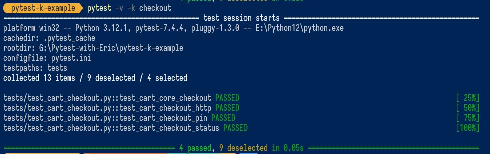
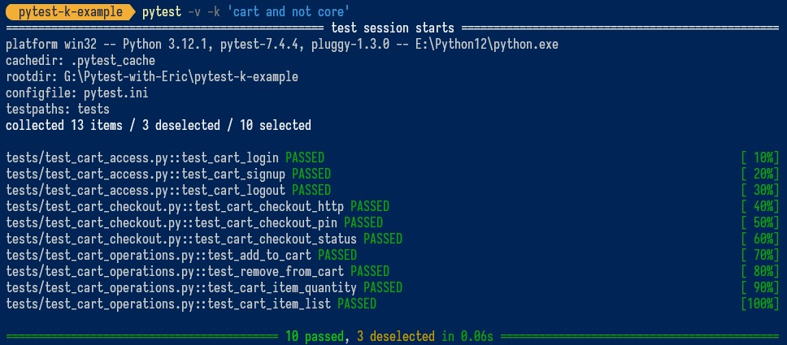
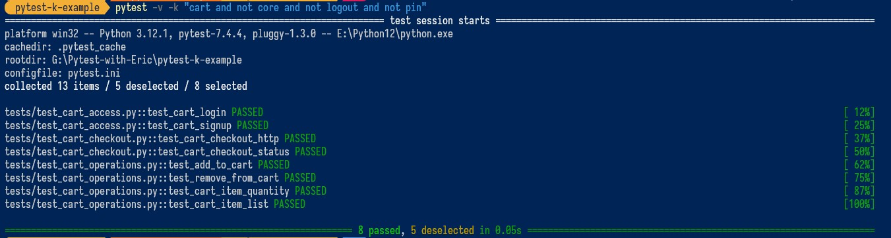
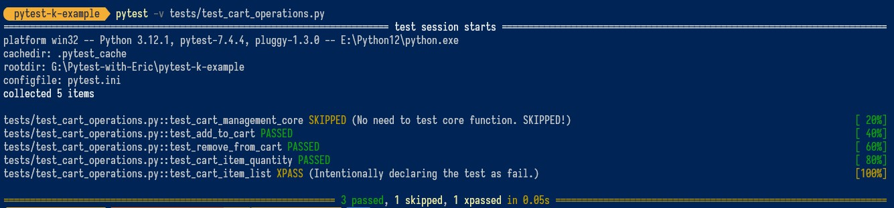
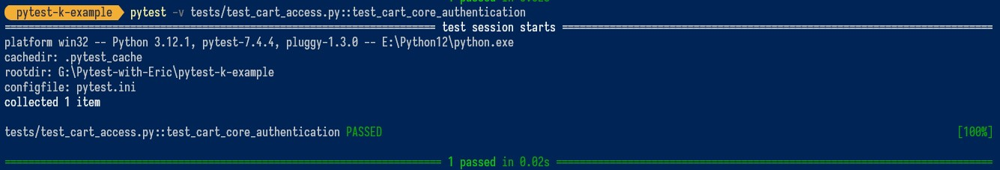

# How to Filter and Group Tests Effortlessly with Pytest -k Options (CLIENT PROJECT)

Have you ever had to wade through hundreds or thousands of tests to run a few specific ones? 

Running `pytest` in the terminal, executes all the tests which not only takes a long time but is also inefficient.

Maybe you can run a test in a specific directory but that too carries overhead and is hard to do repeatedly for tests in different directories.

So how do you filter tests in Pytest? How can you tell Pytest to run only the tests you're interested in? Something like a regular expression?

<!-- more -->

The solution is incredibly simple, and it's with the Pytest `-k` option.

The Pytest `-k` option (k for keyword) allows you to filter or group your tests by keyword and keyword expressions, saving your valuable time when working on large test suites, allowing you to selectively run tests based on their names.

In this article, you'll explore the Pytest `-k` option and learn how to use it for running very specific tests using practical code examples.

By the end of this article, you'll have a solid understanding of how to use Pytest `-k` option to filter and group tests effortlessly.

Let's get started.

[Example Code Repo](https://github.com/Pytest-with-Eric/pytest-k-example.git)

## What You’ll Learn
By reading this article, you’ll learn
- What are Pytest `-k` options, and how to use them to selectively run tests based on names and expressions
- Other options to filter and group tests
- Best practices when using the Pytest `-k` option

## Understanding the Pytest -k Option
Imagine you have a large test suite with hundreds or thousands of tests, each covering a different aspect of the application - security, login, auth, checkout, etc.

How can you group or filter tests, running only essential tests?

That's where Pytest `-k` option comes into play.

Pytest `-k` is a command-line option that enables you to filter tests based on their names.

With Pytest `-k`, you can filter tests by specifying a substring, or a Python expression.

Here's how you can utilize Pytest `-k`:

**Specifying a Substring:**

Pytest `-k` allows you to execute groups of tests that contain a specific substring in their names.

```shell
pytest -k http
```
The above command filters the tests containing the substring `http` in their names like `test_http_request`, `test_http_response`, and `test_http_status`.

**Using Python Expressions:**

Pytest `-k` also supports using Python expressions such as `and`, `or`, and `not`. This allows you to exclude specific tests from the execution list.

```shell
pytest -k "not slow and not performance"
```

This command would execute all tests except those with `slow` and `performance` in their names.

## Why Use Pytest -k Options?
Now that you've grasped the concept of Pytest `-k` for filtering and grouping tests, let's quickly outline how your project can benefit from its usage: 

**Selective Testing:** When you have large test suite but want to [selectively run tests](https://pytest-with-eric.com/introduction/pytest-run-single-test/), Pytest `-k` options allow you to do that without running the entire test suite and focus on the specific area of your code base.

**Continuous Integration:** In CI/CD pipelines, Pytest -k options allow you to execute specific test sets based on the code changes. For example, if a commit message fixes a bug related to signup functionality, the CI script can use `pytest -k "signup"` to trigger only the signup-related tests. This reduces the overall execution time and provides faster feedback.

**Debugging:** Filtering tests allow you to narrow down the scope of testing to aid in debugging efforts. Pytest -k options enable you to isolate the problem by applying relevant keywords of failing tests. Pytest will only run that test and its dependencies, focusing specific subset of tests relevant to the code you're debugging. 

**Integration Testing:** In integration testing scenarios, where you have tests spanning multiple components or systems, filtering tests by name lets you selectively run tests related to specific integrations or components. For example, you might use databases (e.g., MySQL) for storing user login credentials. Pytest -k options allow you to execute tests that require MySQL support.

**Group Tests:** Pytest `-k` options allow you to create a group of tests based on specified naming conventions. For example, you can group tests relevant to API CRUD operations. This is helpful when you're working on a module-based architecture.

## Practical Example
Let's explore this concept with a simple dummy "add to cart" system.

### Prerequisites
Some basics of Python and Pytest would be helpful:
- Python (3.12 or the latest one)
- Pytest

### Getting Started
Our example repo looks like this:

```shell
.  
├── .gitignore
├── README.md
├── pytest.ini
├── requirements.txt
├── tests
│   ├── __init__.py
│   ├── test_cart_access.py
│   ├── test_cart_checkout.py
│   └── test_cart_operations.py
└── src
```
To get started. clone the Github Repo [here](https://github.com/Pytest-with-Eric/pytest-k-example.git), or you can create your own repo by creating a folder and running `git init` to initialize it.

Create a virtual environment and install the required packages using the following command:

```shell
pip install -r requirements.txt
```
Feel free to use any package manager you wish.

## Test Code
Let's create a simple add-to-cart system with three test modules: `test_cart_access.py`, `test_cart_checkout.py`, and `test_cart_operations.py`.

This has been deliberately kept simple to focus on the Pytest `-k` options.

`tests/test_cart_access.py`
```python
# Testing cart authentication module
def test_cart_core_authentication():
    assert True

# Testing cart login 
def test_cart_login():
    assert True

# Testing cart signup 
def test_cart_signup():
    assert True

# Testing cart logout
def test_cart_logout():
    assert True
```

The above functions test the access mechanism.

`tests/test_cart_checkout.py`
```python
# Testing cart core checkout module
def test_cart_core_checkout():
    assert True

# Testing cart http
def test_cart_checkout_http():
    assert True

# Testing cart checkout pin
def test_cart_checkout_pin():
    assert True

# Testing cart checkout status 
def test_cart_checkout_status():
    assert True
```
The above functions test the checkout system.

`tests/test_cart_operations.py`
```python
# Testing cart core system
def test_cart_management_core():
    assert True

# Testing cart storage health 
def test_add_to_cart():
    assert True

# Testing cart storage status
def test_remove_from_cart():
    assert True

# Testing cart storage free space calculation
def test_cart_item_quantity():
    assert True

# Testing cart storage space formating
def test_cart_item_list():
    assert True
```
The above functions test cart operations like add item, remove item, change quantity, and list management.

## Running Tests with Pytest -K Options
As you already learnd. We've two options to run test with Pytest `-k`,

**Specifying a Substring:**

```shell
pytest -v -k checkout
```
This command will test all the test functions related to `checkout`.
Output:



**Using Python Expressions:**

```shell
pytest -v -k 'cart and not core'
```

This command will run all the tests containing the keyword `cart` but exclude those containing the keyword `core`.

Output:



Let's try something more complex:

```shell
pytest -v -k "cart and not core and not logout and not pin"
```
So, what will this command do?

It will run all the tests containing the keyword `cart` but exclude the test containing the keywords `core`, `logout`, and `pin`. 

This is what the result looks like:



## Other Options to Filter Tests
Not all your tests may have filterable names. In this section, we are going to introduce two different ways to eliminate tests from your shortlist.

### Excluding Tests with Markers
[Pytest markers](https://pytest-with-eric.com/pytest-best-practices/pytest-markers/) are a handy tool that enables you to attach metadata or labels to your test functions, making it easier to organize and customize your test suite.

Markers act like annotations and can be attached to functions, methods, or classes.

You can easily exclude unnecessary tests by applying markers like `@pytest.mark.skip` or `@pytest.mark.xfail`. 

Here, the `@pytest.mark.skip` decoration skips the test, while `@pytest.mark.xfail` marks a test as expected to fail (perhaps due to a pending feature or bug fix).

You can create custom markers and define them in your `pytest.ini` file. This article covers [Pytest markers](https://pytest-with-eric.com/pytest-best-practices/pytest-markers/) in great detail.

`tests/test_cart_operations.py`
```python
import pytest

# Testing cart core system
@pytest.mark.skip(reason="No need to test core function. SKIPPED!")
def test_cart_management_core():
    assert True

# Testing cart storage health 
def test_add_to_cart():
    assert True

# Testing cart storage status
def test_remove_from_cart():
    assert True

# Testing cart storage free space calculation
def test_cart_item_quantity():
    assert True

# Testing cart storage space formating
@pytest.mark.xfail(reason="Intentionally declaring the test as fail.")
def test_cart_item_list():
    assert True
```

Here, we skipped the functions `test_cart_management_core()` and `test_cart_item_list()` using the `@pytest.mark.skip` and `@pytest.mark.xfail` decorators respectively.

Running the test,

```shell
pytest -v tests/test_cart_operations.py
```

The following will be the output.




### Run Test by Node
Sometimes you need to run a specific test module.

You can run the specific test from the targeted test file using the test's node ID, which is essentially its part in the syntax `test_module.py::test_function_name`.

Have a quick look at [this article](https://pytest-with-eric.com/introduction/pytest-run-single-test/) for more details.

```shell
pytest -v tests/test_cart_access.py::test_cart_core_authentication
```
This command will only execute the test function `test_cart_core_authentication()`.



## Best Practices when Using Pytest -K Options
Let's explore some best practices and hints when using Pytest `-k` options.

**Using Meaningful and Descriptive Test Names:** Ensure that test names are descriptive and meaningful, making it easier to filter tests using `-k`. For instance, a name such as `test_api_connection()` clearly indicates that it pertains to testing within the API module. Using [consistent naming conventions](https://pytest-with-eric.com/introduction/python-unit-testing-best-practices/) makes for reliable test filtering with Pytest `-k` options.

**Using Config Files:** If you apply a filter continuously, it's recommended to use [Config files](https://pytest-with-eric.com/configuration/pytest-config-file/). This approach allows you to run a test with a filter without defining the filter on the command every time.
```ini
[pytest]
adopts = 
    -k core
```

**Combining Filters:** Pytest `-k` options allow you to combine filters using Python logical operators (e.g., `and`, `or`,  and `not`) to create complex filtering criteria. This helps to apply multiple filters at a time, making more specific test execution. However, it's important to keep the expressions readable and maintainable. 

**Use Parametrization:** If some tests don't maintain a filterable naming convention, use Pytest parametrization to exclude these tests from your test result. You can use markers like `@pytest.mark.skip` or `@pytest.mark.xfail` for this purpose. We have a complete guide covering [Pytest markers](https://pytest-with-eric.com/pytest-best-practices/).

**Group Tests by Functionality:** Employ prefix or naming conventions to group relevant tests. For example, you can name a test file as `test_user_options.py` where the test functions related to user operations can be stored (e.g., `test_user_option_delete()`, or `test_user_option_create()`). You can now easily filter these tests using `pytest -k "test_user"`.

## Wrapping Up
That's all for this article.

Let's do a quick recap of what you've learned.

In this article, you explored the need for filtering tests by naming or keyword using Pytest `-k` options.

After that, you walked through testing a simple add-to-cart application, demonstrating how Pytest `-k` options come into play.

You've also learned 2 different ways to filter tests using markers and running tests by node which is helpful in other situations like running single tests or handling non-filterable test names.

Overall, the Pytest `-k` option provides a flexible way to select which tests to run based on their names, allowing for efficient test execution based on specific criteria or conditions.

What's next?

I encourage you to try Pytest `-k` options with some of your own test examples for a hands-on experience.

Happy Testing! 🎉


## Additional Readings
[Example Code Repo](https://github.com/Pytest-with-Eric/pytest-k-example.git)  
[How To Debug Failing Tests Like A Pro (Use Pytest Verbosity Options)](https://pytest-with-eric.com/introduction/pytest--v-option/)  
[Pytest Config Files - A Practical Guide To Good Config Management](https://pytest-with-eric.com/configuration/pytest-config-file/)  
[Python Unit Testing Best Practices For Building Reliable Applications](https://pytest-with-eric.com/introduction/python-unit-testing-best-practices/)
[Ultimate Guide To Pytest Markers And Good Test Management](https://pytest-with-eric.com/pytest-best-practices/pytest-markers/)  
[How To Run A Single Test In Pytest (Using CLI And Markers)](https://pytest-with-eric.com/introduction/pytest-run-single-test/)  
[My Most Used pytest Commandline Flags](https://adamj.eu/tech/2019/10/03/my-most-used-pytest-commandline-flags/)  
[Using -k expr to select tests based on their name](https://docs.pytest.org/en/latest/example/markers.html#using-k-expr-to-select-tests-based-on-their-name)  