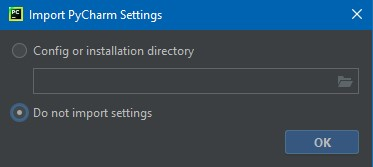

# How To Configure PyCharm To Run Pytest (Step-By-Step Guide) (CLIENT PROJECT)

Have you ever wanted to run a single unit test only to find yourself running the entire test suite every time, wasting valuable time and resources?

[Running a single test](https://pytest-with-eric.com/introduction/pytest-run-single-test/) is entirely possible with Pytest, but it's not as straightforward or user-friendly.

What if you want to define configurations for your tests, such as environment variables, custom arguments, verbosity and run them with a single click repeatedly?

How about if you wanted to add a debugger or line breakpoints to your tests?

You'd kinda struggle to do all of this in the terminal without some advanced command-line flags, what if there was an easier way?

<!-- More -->

[PyCharm](https://www.jetbrains.com/pycharm/) is a powerful Python IDE (Integrated Development Environment) that offers advanced features for testing and debugging, streamlining the CI/CD process. 

Integrating Pytest with PyCharm significantly enhances your overall testing experience.

PyCharm's intuitive interface allows you to run tests, debug code, and generate coverage reports with a single mouse click, saving you valuable time and effort.

In this article, I'll walk you through setting up and configuring Pytest in the PyCharm IDE.

We'll go through a step-by-step guide to help you get started with Pytest in PyCharm to facilitate a smoother testing experience.

Let's get started.

[Example Code](https://github.com/Pytest-with-Eric/pytest-pycharm-integration-example.git)

## What You’ll Learn
By the end of this article you should be able to:

- Set up and configure Pytest to integrate with PyCharm
- Create projects or open existing projects and detect or write tests in PyCharm
- Execute the test using Pytest in PyCharm
- Debug tests effectively using the Pytest-PyCharm integration
- Resolve common errors that may occur while working with Pytest in PyCharm

## Overview of Pytest

If you're new to this website, you may wonder - Why Pytest? Why not Unittest or Nose?

We've compared these in great detail in our article on the [Practical Overview Of The Top 5 Python Testing Frameworks](https://pytest-with-eric.com/comparisons/python-testing-frameworks/).

Pytest is the most widely used testing framework, known for its simplicity, flexibility, and powerful capabilities.

Pytest lets you write clean and understandable code with a simple syntax, less boilerplate, and more expressive test cases. It offers excellent community support, plugins, and documentation.

Pytest contains advanced features like [fixtures](https://pytest-with-eric.com/pytest-best-practices/pytest-fixtures/), [markers](https://pytest-with-eric.com/pytest-best-practices/pytest-markers/), [parametrization](https://pytest-with-eric.com/introduction/pytest-parameterized-tests/), [hooks](https://pytest-with-eric.com/hooks/pytest-hooks/) and plugins, making it the ideal testing framework for Python developers.

The next section briefly discusses PyCharm's features, explaining why you should pair Pytest and PyCharm for a more efficient testing experience.


## Why Pytest in PyCharm
PyCharm is a popular and powerful Python IDE, offering several features to help your team work more efficiently. 

Pairing Pytest with PyCharm enhances your testing experience, allowing you to run tests, debug code, and generate coverage reports with a single mouse click.

Through the Pytest-PyCharm integration, you can:

- **Run Tests:** Execute tests with a single click, saving time and effort.
- **Debug Tests:** Debug tests effectively using the Pytest-PyCharm integration.
- **Generate Coverage Reports:** Generate coverage reports to measure the percentage of code that has been validated using a Unit Testing Framework.
- **Resolve Common Errors:** Resolve common errors that may occur while working with Pytest in PyCharm.
- **Customize and Extend:** Customize and extend your environment based on your needs.
- **Integrate with External Tools:** Integrate external tools and utilities using Python projects such as package managers, databases, build tools, and frameworks.
- **Version Control Integration:** Configure version control systems such as Git, Mercurial, and Subversion. Execute version control tasks directly in the IDE, such as committing changes, analyzing diffs, and managing branches.

We've written a similar guide on how to do the same with [VSCode](https://code.visualstudio.com/). [Check it out here](https://pytest-with-eric.com/introduction/how-to-run-pytest-in-vscode/).


## Practical Example
Let's look at a very simple example to demonstrate how to integrate Pytest with PyCharm.

A simple Python program to check if a given year is a leap year or not.

### Prerequisites
To follow this guide, you should have:
- [PyCharm (Community/Professional)](https://www.jetbrains.com/pycharm/)
- Python 3.12 installed.
  
### Getting Started
Our example code repo looks like this,

```shell
├── .gitignore
├── README.md
├── pytest.ini
├── requirements.txt
├───src
│   └── leap_year.py
└───tests
    └── test_leap_year.py
```
To get started. clone the Github Repo [here](https://github.com/Pytest-with-Eric/pytest-pycharm-integration-example.git) to your local machine using the terminal, GitHub Desktop, or any other Git client.

Note - In this article, we'll use PyCharm to create and manage our virtual environment. However, you can create your own virtual environment and have PyCharm detect it.

### Writing the Code
**Example Code**
Our example code is a simple leap year finder.

`src/leap_year.py`
```python
def check_leap_year(year:int) -> str:
    """
    Function to check if the given year is a leap year.
    
    Args:
    year: integer

    Returns:
    String "Leap Year" or "Not Leap Year"
    """

    ## Divided by 100 means century year.
    ## And century year divided by 400 means
    if (year % 400 == 0) and (year % 100 == 0):
        return "Leap Year"

    ## Not divided by 100 means not a century year.
    ## Year divided by 4 is a leap year.
    elif (year % 4 == 0) and (year % 100 != 0):
        return "Leap Year"

    ## Not divided by 4 and 400 means not a leap year.
    else:
        return "Not Leap Year"
    

def main(year:int) -> None:
    print(check_leap_year(year))

if __name__ == '__main__':
    main(2000)
```
Here, the `check_leap_year()` function identifies a leap year.

**Test Code**
Let's develop some tests for the example code.

`tests/test_leap_year.py`
```python
from src.leap_year import check_leap_year

# Testing with leap year
def test_leap_year():
    assert check_leap_year(2000) == "Leap Year"


# Testing with not leap year
def test_not_leap_year():
    assert check_leap_year(2001) == "Not Leap Year"


# Testing failed result
def test_not_leap_year_2():
    assert False
```

In the test, the functions `test_leap_year()` and `test_not_leap_year()` run against the function `check_leap_year()`. 

We intentionally created a failed test with the function `test_not_leap_year_2()` to demonstrate what a failed result looks like.

## How To Configure PyCharm To Run Pytest
### Install PyCharm
PyCharm is available in two editions: Professional and Community. 

The community edition offers essential features such as code navigation, version control, and intelligent code completion. 

On the other hand, the Professional Edition provides advanced functionalities like advanced debugging tools, database tools, and support for various web development tools.

Visit [Jetbrain's official website](https://www.jetbrains.com/pycharm/download/) to download PyCharm. Select `.exe` or `.dmg`, depending on your operating system.


JetBrains makes you install the Professional Edition by default. However, you can download the free community version from the bottom on the page.


During installation, you can choose to import existing settings if you have them or start from scratch.



### Open an Existing Project or Create a Project
**Open an Existing Project**

We're going to open the existing project we cloned earlier.

Clone [the repo](https://github.com/Pytest-with-Eric/pytest-pycharm-integration-example.git) if not already. Now, click "**Open**" from the opening window and locate the project.


Then click "**Trust Project**" in the confirmation window. 


PyCharm allows you to create a `venv` automatically.


Moreover, you can go to **File > Settings > Project:YOUR_PROJECT > Interpreter** to create a custom `venv`. 

Then, click on **Add Interpreter > Add Local Interpreter** and provide details like Base Interpreter, Location, etc.

**Create a Project (Optional)**
You can open a Git repository as an existing project in PyCharm. However, To create your own project, follow this step.

To create a project in PyCharm, click `New Project`, fill in details like project name, location, etc. and click `Create`.


### Create a Virtual Environment
PyCharm allows you to create a project-specific, isolated virtual environment. The following steps will walk you through creating a virtual environment.

Click the `Gear` icon at the top right corner, then click on settings,


Inside **Project: Project_Name > Python Interpreter** (Already open by default). You can see a list of installed packages for your current virtual environment. 


Click "**Add Interpreter**", then "**Add Local Interpreter**",


Inside the **Virtualenv environment**, there are a few options:


**Environment:** Select the new to create a new virtual environment. Or, you can import and existing virtual environment by clicking "Existing" and browse the location of `venv`.


**Location:** If creating a new `venv`, define the location of the virtual environment.
**Base interpreter:** If creating a new `venv`, select the base interpreter.

Mark the **Inherit global site-packages** checkbox if you want all packages installed in the global Python on your machine to be added to the virtual environment you're going to create. 


Lastly, click on **OK**.

You can switch to virtual environments by clicking the right button corner, mentioning your project name. 

Now select a virtual environment.


### Writing Tests
Pytest will automatically detect tests in the `tests/` directory.

You can also add tests for a function by right-clicking on its name and selecting **Go To > Test**.


Now click `Create New Test...`


### Configuring PyCharm for Pytest (Optional)
**Set Pytest as Default Test Runner**
To set Pytest as the default test runner, click on the `Gear` icon at the top right corner or go to **File > Settings** and navigate **Tools > Python Integrated Tools**,


In the `Testing` option, set the default test runner to Pytest.


Finally, click `Apply` then `OK`.

**Providing Configuration for Pytest**
You can apply more test configurations by going **Run > Edit Configuration**.


Let's describe the options:

- **Target: Module name/Script path/Custom**: Radio buttons to choose the possible target: Module name, Script path, and custom.

- **Keywords**: Expression to match test names (e.g., `-k http` to match file names containing the substring `http` like `test_http`). Check out this official doc for [more](https://docs.pytest.org/en/latest/example/markers.html#using-k-expr-to-select-tests-based-on-their-name) details.
- **Parameters**: Specify data sample for parametrized test. For example, set 2-2 in this field for the sample test:
```python
import pytest

@pytest.mark.parametrize("foo,bar", [
    (1, 1),
    (2, 2),
    (3, 3),
])
def test_true(foo, bar):
    assert foo == bar
```
- **Additional Arguments**: Provide additional arguments (e.g., [-verbose, -v](https://pytest-with-eric.com/introduction/pytest--v-option/) or other [custom arguments](https://pytest-with-eric.com/pytest-advanced/pytest-addoption/)).
- **Environment variable**: Specify the desired set of environment variables in the Environment Variables dialog (e.g., `API_ENDPOINT=www.test_api_endpoint.com
`). To set an environment variable, click the explore button, then click the plus icon to create an environment variable, and enter the desired name and value. 


This article briefly discusses defining [environment variables](https://pytest-with-eric.com/pytest-best-practices/pytest-environment-variables/).
- **Python Interpreter**: Specify the command-line options.
- **Working directory**: Specify a directory to be used by the running task.
- **Add content roots to PYTHONPATH**: Checkbox to add all content roots of your project to the environment variable PYTHONPATH;
- **Add source roots to PYTHONPATH**: Checkbox to add all source roots of your project to the environment variable PYTHONPATH;

You'll find more details about these options [here](https://www.jetbrains.com/help/pycharm/run-debug-configuration-py-test.html).

You may also provide these options in Pytest configuration files like `pytest.ini`, `pyproject.toml`, `setup.cfg`, and `tox.ini`. [This guide](https://pytest-with-eric.com/configuration/pytest-config-file/) will tell you how.

## Running Tests
To run tests, click on the **Play** icon at the top of the window,


It will run all the tests inside the `tests/` directory,


Notice the screenshot and see how PyCharm marks a failed and passed test.

You can also run single tests by using the **Play** icon on the left side of each function,


Now, you have the test results for a single test function,


## Installing Pytest Manually
We sometimes need to install Pytest manually for a variety of reasons, such as fixing errors, Pytest updates, and so on.

To install Pytest manually in your PyCharm environment, go to the bottom left corner of the window and click the `Stack` icon.


Now, search for Pytest, and you'll see it at the top under the `PyPL` section. 


Click on it and you'll find the `Install package` option at the right.


After the successful installation of Pytest. You'll see a message like the one below,


## Troubleshooting Common Issues

**Failed to create virtual environment in PyCharm or PyCharm doesn't recognize the virtual environment**

When you launch a project, it prompts you to create or use a virtual environment. However, PyCharm occasionally displays an error message when creating or failing to detect your `venv` and doesn't recognize your package.

To resolve, delete the existing `venv` folder to allow PyCharm to recreate it. Reinstall the `python3-venv` package if the issue persists.

Alternatively, navigate to `File > Settings > Project:YOUR_PROJECT > Python Interpreter > Add Interpreter > Add Local Interpreter` to add a new virtual environment or locate an existing virtual environment.


**No module named 'pytest' within PyCharm**
Sometimes when executing tests, you might encounter an error message such as "ModuleNotFoundError: No module named 'pytest'". This hiccup often occurs after upgrading your PyCharm version.

To fix this, reinstall the package following the [official documentation by JetBrains](https://intellij-support.jetbrains.com/hc/en-us/community/posts/9007972337682-No-module-named-pytest-within-PyCharm-works-in-Python-CLI).

You can also try to install `pytest` manually as described in the previous section.

**FileNotFoundException in PyCharm**
When running tests, you may encounter an error mentioning `FileNotFoundException`. This occurs when PyCharm fails to detect tests or the test files are placed incorrectly within the directory structure.

To fix it, ensure tests are placed in the correct directory. Then, navigate to **Run > Edit Configuration** and execute tests from the root directory by enabling "Add source roots to PYTHONPATH".


**Pytest-html error in PyCharm**
You can generate an HTML report by installing the `pytest-html` plugin. However, occasionally, when running tests, you may encounter the following error:

```shell
ERROR: file not found: html=report\result.html
```
To fix it, go to **Run > Edit Configuration** and provide the following argument in the "Additional argument" section.

```shell
--html=Reports/Report.html  --self-contained-html
```


## Code Coverage (Professional Edition Only)
A Coverage Report shows how a % measure of code that has been validated using a Unit Testing Framework (e.g. Unittest or Pytest). 

[This article](https://pytest-with-eric.com/pytest-best-practices/pytest-code-coverage-reports/) covers coverage reports in depth.

To create a coverage report. Open your preferred test file and left-click on it. Now, click the **Run with Coverage** option.

You can view the coverage data by clicking on the **Shield** symbol in the upper right corner. Feel free to experiment with the PyCharm Professional Edition to see the coverage report.


## Wrapping Up
That's all for today.

This comprehensive guide walks you through setting up and configuring Pytest in the PyCharm IDE.

You've learned to create projects or open existing repositories and detect or write tests in PyCharm.

You've also executed tests using Pytest in PyCharm, debugged tests effectively, and resolved common errors that may occur while working with Pytest in PyCharm.

Additionally, you've learned to fix common issues encountered while working with PyCharm, ensuring a smooth testing experience.

This handy tool can save you time and effort, for once you've set it up you don't have to worry about running tests manually or managing the configurations yourself.

Happy Testing! 🎉

## Additional Readings
[Example Code](https://github.com/Pytest-with-Eric/pytest-pycharm-integration-example.git)  
[How To Run Pytest In VS Code (Easy To Follow Step-By-Step Tutorial)](https://pytest-with-eric.com/introduction/how-to-run-pytest-in-vscode/)  
[How Pytest Fixtures Can Help You Write More Readable And Efficient Tests](https://pytest-with-eric.com/pytest-best-practices/pytest-fixtures/)  
[How to Effortlessly Generate Unit Test Cases with Pytest Parameterized Tests](https://pytest-with-eric.com/pytest-best-practices/pytest-markers/)  
[3 Simple Ways To Define Your Pytest Environment Variables With Examples](https://pytest-with-eric.com/pytest-best-practices/pytest-environment-variables/)
[Pytest Config Files - A Practical Guide To Good Config Management](https://pytest-with-eric.com/configuration/pytest-config-file/)
[How To Generate Beautiful & Comprehensive Pytest Code Coverage Reports (With Example)](https://pytest-with-eric.com/pytest-best-practices/pytest-code-coverage-reports/)
[How To Debug Failing Tests Like A Pro (Use Pytest Verbosity Options)](https://pytest-with-eric.com/introduction/pytest--v-option/)
[How To Use Pytest With Command Line Options (Easy To Follow Guide)](https://pytest-with-eric.com/pytest-advanced/pytest-addoption/)
[Pytest parametrization here](https://pytest-with-eric.com/introduction/pytest-parameterized-tests/)
[Run/Debug Configuration: pytest](https://www.jetbrains.com/help/pycharm/run-debug-configuration-py-test.html)
[Pytest](https://www.jetbrains.com/help/pycharm/pytest.html)  
[Installing PyTest in PyCharm IDE (PyTest - Part 4)](https://www.youtube.com/watch?v=ubVAUcL5o48)  